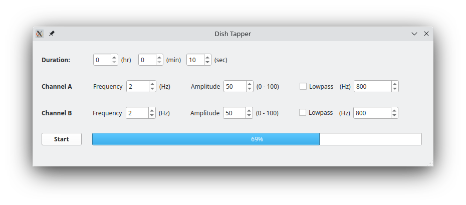

# Servodoor-app: RC servo based door control application  

A simple GUI for controlling the petrish dish tapping device.

## Installing
Install using pip 

```bash
$ pip install dish-tapper-software 
```

## Installing from source

This package uses the [poetry](https://python-poetry.org/) dependency manager.
The installation instructions for poetry can be found
[here](https://python-poetry.org/docs/#installation)

Once poetry is installed the serovodoor-app package can be installed using

```bash
$ poetry install
```
Additional documentation on using poetry can be found
[here](https://python-poetry.org/docs/)

## GUI images




